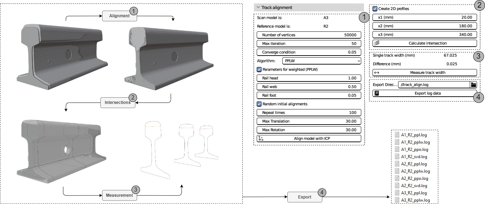

# TrackAlignment
A blender addon tool to align the railway track to coordinates

More information will be uploaded after the related OES2023 paper is accepted.

https://user-images.githubusercontent.com/82582362/227495762-95b228d9-0b91-426c-822a-70f8445a9258.mp4

